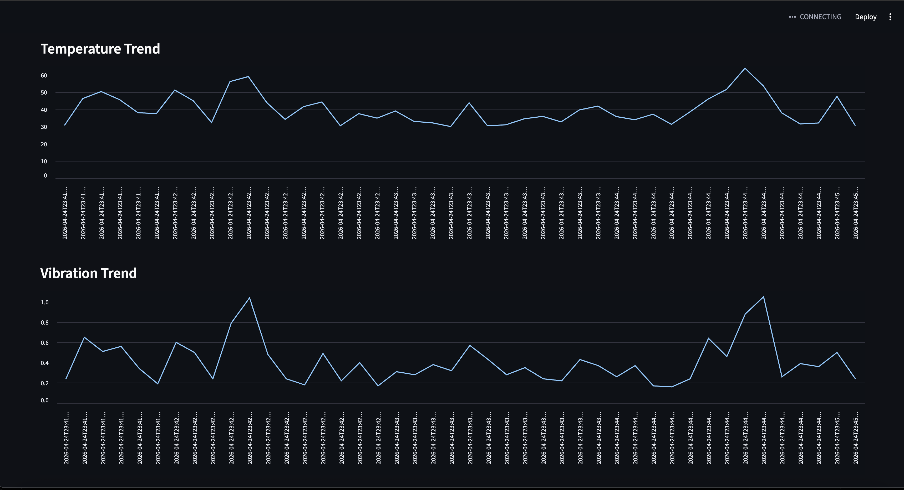

# Industrial Equipment Monitoring System

Built an end-to-end monitoring system that simulates industrial machine telemetry, sends data through a backend API, stores historical readings in a database, and visualizes machine health through a live dashboard.

I built this project because I wanted something that felt closer to real industrial/defense systems work than typical CRUD/web projects. I was interested in how telemetry pipelines work in environments where reliability, anomaly detection, and system monitoring matter.

The project simulates multiple industrial machines generating:

- temperature readings  
- vibration readings  
- warning states  
- critical failures  

and pushes that data through a full monitoring pipeline.

---

## Architecture

```text
Telemetry Simulator
        ↓
Flask API
        ↓
SQLite Database
        ↓
Streamlit Dashboard
```

---

## What it does

### Simulates multiple machines
The system currently simulates:

- MOTOR_01  
- MOTOR_02  
- CONVEYOR_01  
- COOLING_FAN_01  

Each machine has:

- different operating thresholds  
- different temperature ranges  
- different vibration ranges  
- different failure probabilities  

---

### Simulates failures
The simulator randomly generates:

- normal operating states  
- warning conditions  
- critical failures  

Examples include:

- overheating  
- excessive vibration  
- abnormal operating behavior  

This was added so I could test how the monitoring system responds to failures rather than only normal behavior.

---

### Sends telemetry through an API
The simulator sends readings to a Flask backend using POST requests.

I intentionally separated the simulator from the database layer so the architecture would feel closer to how real telemetry systems are designed.

---

### Stores historical telemetry
The backend stores readings in SQLite.

This allows:

- trend analysis  
- debugging  
- reviewing failure history  

instead of only looking at the latest reading.

---

### Dashboard visualization
The Streamlit dashboard allows users to:

- filter by machine  
- monitor current machine health  
- view temperature trends  
- view vibration trends  
- see critical alerts  
- review historical readings  

---

## Dashboard





---

## Tech Stack

- Python  
- Flask  
- SQLite  
- Streamlit  
- Pandas  
- Requests  

---

## Biggest things I learned

- designing systems with multiple components communicating together  
- API design basics  
- database persistence  
- debugging integration issues between services  
- thinking about fault tolerance and scalability  

---

## Running the project

```bash
python backend.py
python telemetry_simulator.py
streamlit run dashboard.py
```

---

## Future improvements

- MQTT instead of HTTP polling  
- real hardware sensors  
- cloud deployment  
- predictive maintenance models  
